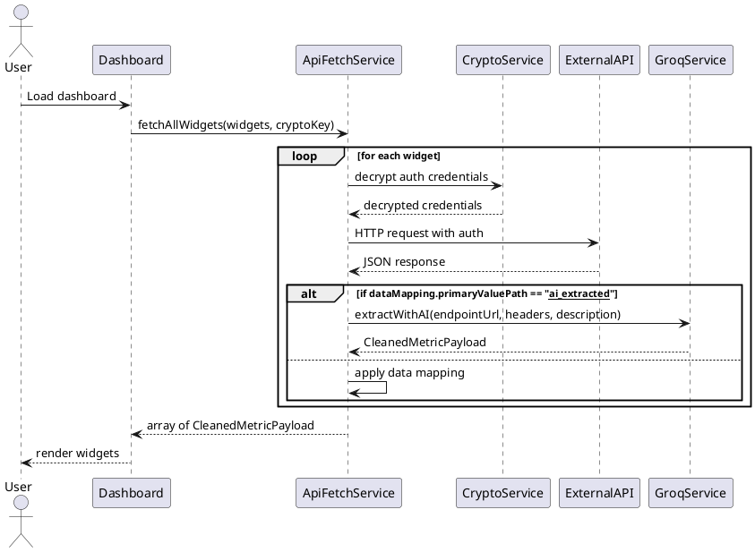
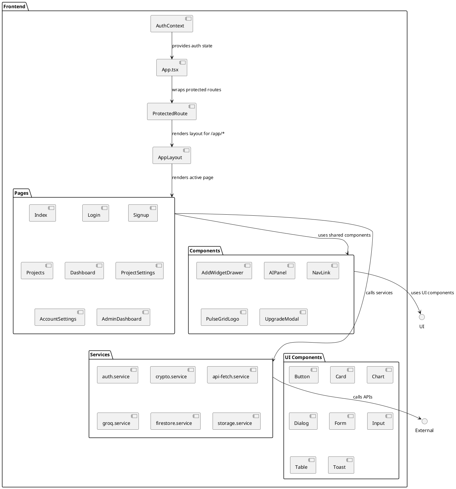
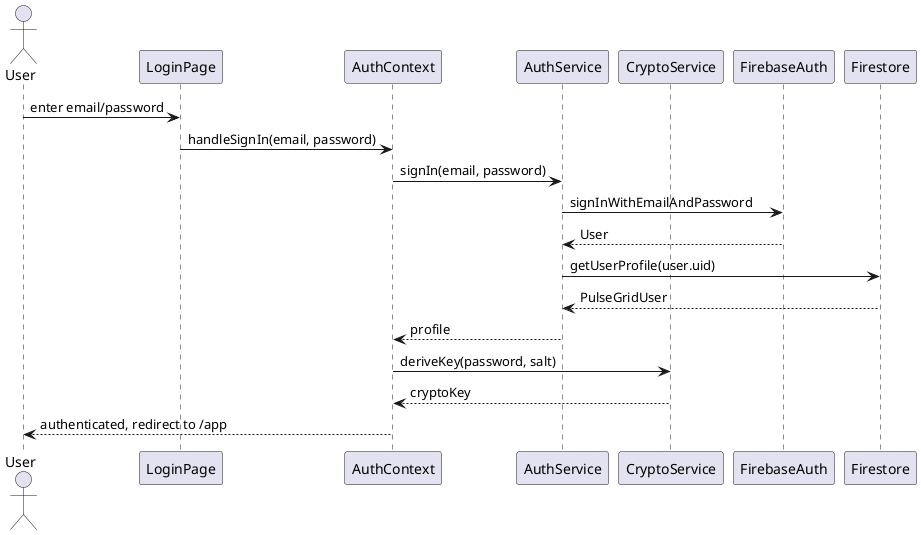
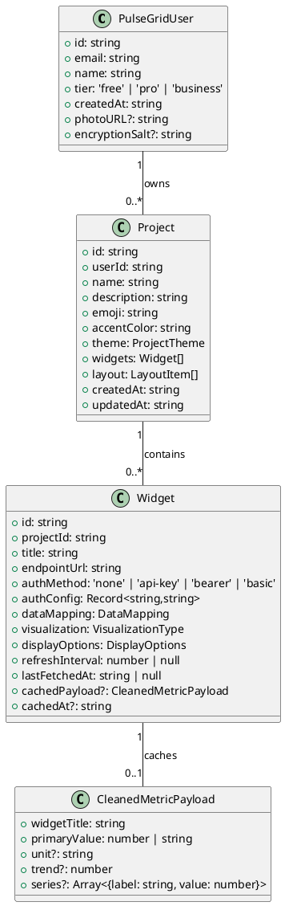

# PulseGrid UML Guide Skill

## Description

This skill provides guidance and PlantUML code snippets for creating UML diagrams that represent the architecture of the PulseGrid project. The diagrams are based on the INSTRUCTIONS.md document and the current React/TypeScript implementation.

The project is a SaaS Business Intelligence platform built with React, Vite, TypeScript, Tailwind CSS, and Firebase, following the architectural principles outlined in INSTRUCTIONS.md.

## Key Architectural Elements

- **Frontend**: React with functional components, hooks, and context for state management.
- **Services**: Modular services for auth, crypto, API fetching, AI analysis, etc.
- **Data Flow**: REST API → api-fetch.service → components, with AI analysis proxied through backend.
- **Security**: Web Crypto API for client-side encryption of API keys.
- **Auth**: Firebase Auth with JWT-like tokens for backend.

## UML Diagrams

### 1. Class Diagram - Core Services

```plantuml
@startuml
class AuthService {
    +signUp(email: string, password: string, name: string): Promise<User>
    +signIn(email: string, password: string): Promise<User>
    +signOut(): Promise<void>
    +getUserProfile(uid: string): Promise<PulseGridUser>
}

class CryptoService {
    +generateSalt(): Uint8Array
    +deriveKey(password: string, salt: Uint8Array): Promise<CryptoKey>
    +encrypt(data: string, key: CryptoKey): Promise<string>
    +decrypt(ciphertext: string, key: CryptoKey): Promise<string>
}

class ApiFetchService {
    +fetchWidgetData(widget: Widget, cryptoKey: CryptoKey | null): Promise<CleanedMetricPayload>
    +testConnection(widget: Widget, cryptoKey: CryptoKey | null): Promise<boolean>
    -buildAuthHeaders(authMethod: string, credentials: Record<string,string>, cryptoKey: CryptoKey | null, isEncrypted: boolean): Promise<Record<string,string>>
}

class GroqService {
    +analyzeWithAI(request: AnalysisRequest): Promise<AIResponse>
    +extractWithAI(endpointUrl: string, authHeaders: Record<string,string>, description: string): Promise<CleanedMetricPayload>
    +callSalesChatbot(message: string, history: Array<{role: string, content: string}>): Promise<string>
}

class FirestoreService {
    +createProject(project: Project): Promise<void>
    +getProjects(userId: string): Promise<Project[]>
    +updateProject(id: string, updates: Partial<Project>): Promise<void>
    +deleteProject(id: string): Promise<void>
    +createWidget(widget: Widget): Promise<void>
    +getWidgets(projectId: string): Promise<Widget[]>
    +updateWidget(id: string, updates: Partial<Widget>): Promise<void>
    +deleteWidget(id: string): Promise<void>
}

class StorageService {
    +getProjects(): Project[]
    +setProjects(projects: Project[]): void
    +getEncryptedCredentials(): Record<string,string>
    +setEncryptedCredentials(creds: Record<string,string>): void
    +getEncryptionSalt(): string
    +setEncryptionSalt(salt: string): void
    +getThemePreference(): string
    +setThemePreference(theme: string): void
}

AuthService --> CryptoService : uses for key derivation
ApiFetchService --> CryptoService : uses for decryption
ApiFetchService --> GroqService : uses for AI data extraction
@enduml
```

### 2. Sequence Diagram - Widget Data Fetch Flow

### 3. Component Diagram - Frontend Architecture

### 4. Sequence Diagram - Authentication Flow

### 5. Class Diagram - Data Models

## Usage Instructions

1. Install the PlantUML extension in VS Code.
2. Create a new file with `.puml` or `.plantuml` extension.
3. Copy the PlantUML code from the relevant diagram above.
4. The extension will render the diagram in the editor.
5. Export to PNG/SVG for reports.

## Notes

- The architecture follows the principles in INSTRUCTIONS.md, adapted to React.
- Services are implemented as modules with exported functions, modeled as classes in UML for clarity.
- React components are functional, but represented as classes in diagrams.
- Data flow emphasizes security with client-side encryption and backend proxying for AI calls.

This guide provides a starting point; diagrams can be customized as needed for specific reports or documentation.</content>
<parameter name="filePath">c:\Users\Jawha\Downloads\bi powerbi\pulsegrid-vision\UML_GUIDE.md